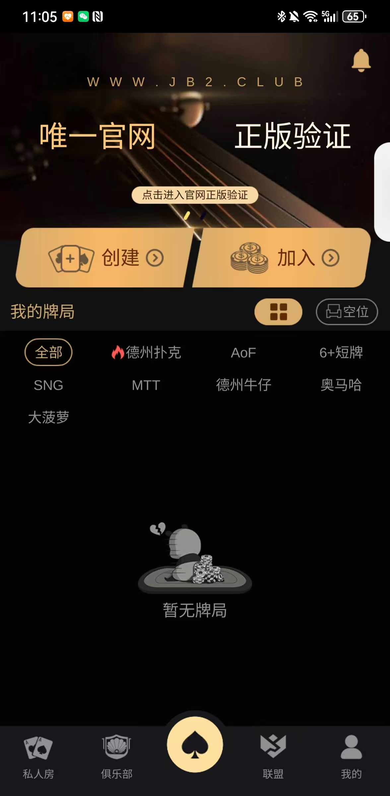
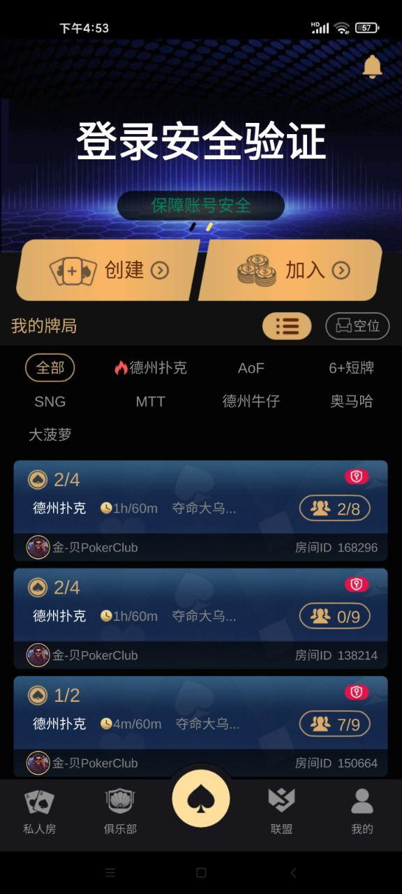
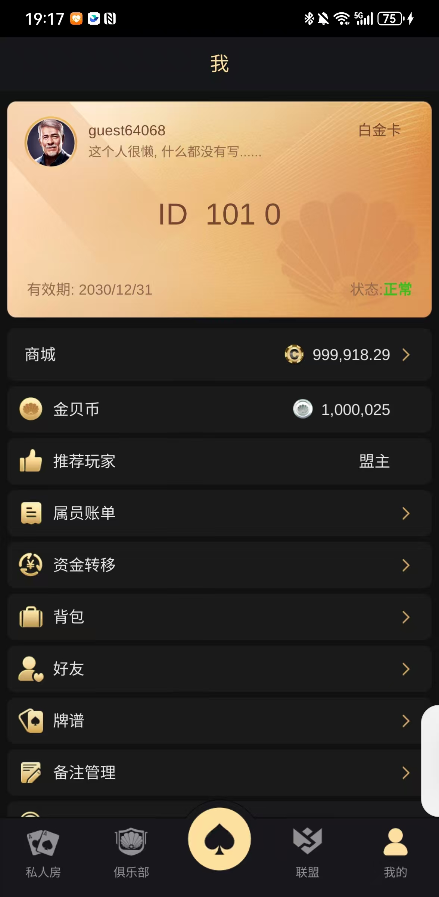
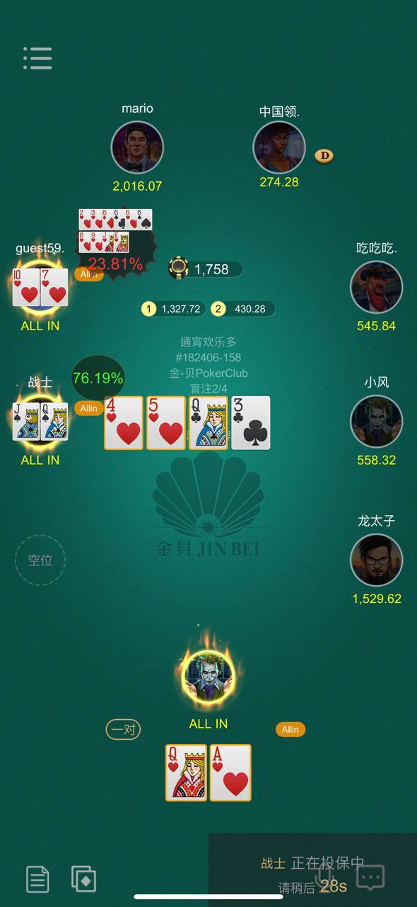
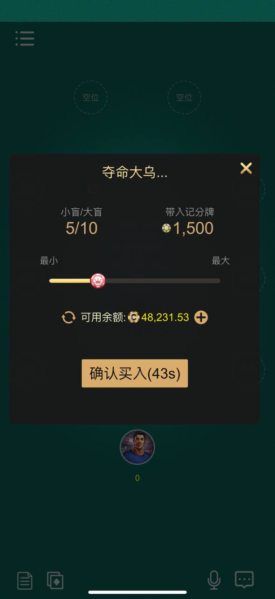

# Poker Club Platform Source Code

[简体中文](README.md) | [繁體中文](README.zh-TW.md) | [English](README.en.md)

This project is a commercial-grade Texas Holdem poker club platform source code project for poker clubs, coin lobbies, alliance systems, private rooms, MTT tournaments, player centers, and multi-mode poker products. It is suitable for product presentation, technical evaluation, secondary development, private deployment,.

## Reading and Download

- Online homepage: https://alibabamayun888.github.io/poker-club-platform/
- GitHub repository: https://github.com/alibabamayun888/poker-club-platform
- Please read this README first, then check the published product page from `docs/index.html`.
- To download the source code, click `Code` in the upper-right corner of the repository and choose `Download ZIP`.

## Project Positioning

This repository focuses on **Poker Club Platform Source Code**. It can be used to present a Texas Holdem poker club platform, coin lobby, alliance system, private rooms, MTT tournaments, player center, coin gift features, and multiplayer online poker capabilities.

## Product Screenshots

## 📞 联系我们 | Contact

| 渠道 | 联系方式 |
|------|---------|
| 📧 Email | ttpoker40@gmail.com |
| 💬 Telegram | [@alibabama401](https://t.me/alibabama401) |
| 🐛 Issues | [GitHub Issues](https://github.com/alibabamayun888/poker-club-platform/issues) |

## Core Capabilities

- Texas Holdem lobby, poker table, game UI, and player center presentation
- Club, alliance, private room, coin lobby, and coin gift feature scenarios
- MTT tournaments, multi-mode gameplay entry, and operation feature presentation
- Suitable for secondary development, UI reskinning, feature expansion, and private deployment
- Can be published through GitHub Pages for Google and Bing indexing

## Use Cases

- Texas Holdem poker club source code presentation
- Technical evaluation for coin lobbies, alliance systems, private rooms, and tournament platforms
- Multiplayer online card game prototype
- GitHub Pages homepage and search engine optimization

## Keywords

Poker club platform, Texas Holdem source code, poker club source code, online poker source code, coin lobby, alliance system, private room, MTT tournament source code, multiplayer poker platform.

## Disclaimer

This project is intended for software source code presentation, technical research, product evaluation, and compliant entertainment system development. Please use it legally according to local laws and platform rules.
