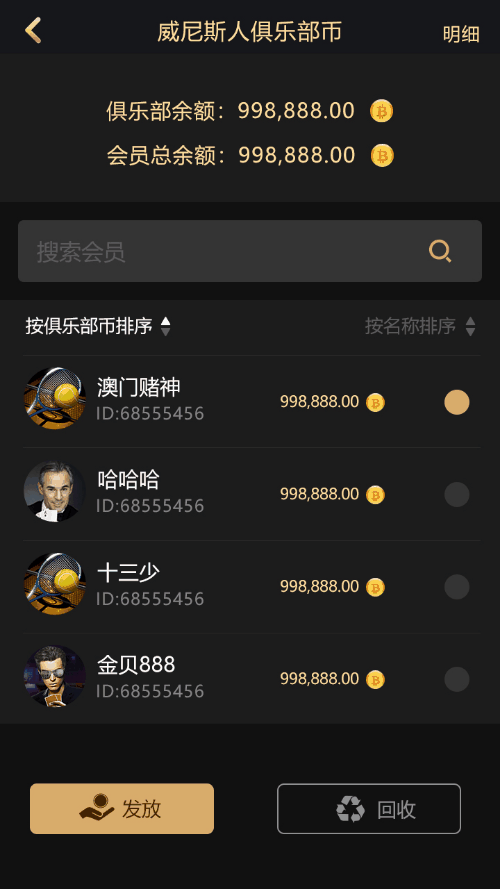

# Poker Club Platform｜德州扑克俱乐部源码｜德州源码

[简体中文](README.md) | [繁體中文](README.zh-TW.md) | [English](README.en.md)

<p align="center">
  
  
  
  
  
</p>

<p align="center">
  <strong>商业级德州扑克俱乐部系统源码｜Commercial-Grade Texas Hold'em Poker Club Source Code</strong><br>
  德州撲克俱樂部系統
</p>

<p align="center">
  <a href="https://github.com/alibabamayun888/poker-club-platform/stargazers"></a>
  <a href="https://github.com/alibabamayun888/poker-club-platform/network/members"></a>
  <a href="https://github.com/alibabamayun888/poker-club-platform/issues"></a>
</p>

## 目录

- [项目简介](#项目简介)
- [核心特性](#核心特性)
  - [游戏玩法](#游戏玩法)
  - [俱乐部系统](#俱乐部系统)
  - [技术架构](#技术架构)
- [系统架构与演示](#系统架构与演示)
- [快速开始](#快速开始)
  - [环境要求](#环境要求)
  - [Docker 一键部署](#docker-一键部署)
  - [源码编译](#源码编译)
- [项目结构](#项目结构)
- [API 文档](#api-文档)
- [常见问题](#常见问题)
- [更新日志](#更新日志)
- [贡献指南](#贡献指南)
- [许可证](#许可证)
- [相关项目](#相关项目)
- [联系我们](#联系我们)

## 项目简介

**Texas Hold'em Poker Club Platform** 是一套完整的运营级德州扑克俱乐部系统源码，采用 **C++17 高性能服务端 + Unity 跨平台客户端** 架构，支持私人牌桌、朋友局、俱乐部联盟、MTT/SNG 锦标赛、分销系统等完整功能。

| 语言 | 项目名称 |
|---|---|
| 中文 | 德州扑克俱乐部系统源码 / 德州游戏源码 / 朋友局源码 |
| English | Texas Hold'em Poker Club Source Code / Poker Platform Source Code |

## 核心特性

### 游戏玩法

- **经典德州扑克**（No-Limit Texas Hold'em）：标准 52 张牌玩法
- **短牌德州**（Short Deck / 6+ Hold'em）：去除 2-5 的快节奏玩法
- **奥马哈**（Omaha Poker）：四张底牌变体
- **大菠萝**（Pineapple / Crazy Pineapple）：趣味三张底牌玩法
- **MTT 多桌锦标赛**（Multi-Table Tournament）：支持千人级同时参赛
- **SNG 单桌锦标赛**（Sit & Go）：满人即开，快速结算
- **AOF 全押或弃牌**（All-in or Fold）：极限刺激模式
- **德州牛仔**（Texas Cowboy）：特色玩法

### 俱乐部系统

- **私人牌桌**（Private Table）：密码保护，邀请制入局
- **朋友局**（Friends Game / 约局）：熟人社交扑克
- **俱乐部联盟**（Club Alliance）：多俱乐部联合运营
- **代理分销系统**（Agent & Affiliate System）：三级分销，自动结算
- **邀请返利机制**（Invite & Rebate System）：裂变增长
- **语音视频聊天**（Voice & Video Chat）：实时互动
- **保险功能**（Insurance / All-in Insurance）：降低 bad beat 风险
- **战绩统计**（Hand History & Statistics）：完整数据复盘

### 技术架构

| 层级 | 技术栈 | 说明 |
|---|---|---|
| 客户端 | Unity 2022.3 LTS | 支持 iOS / Android / H5 / WebGL / Windows / macOS |
| 服务端 | C++17 / Boost.Asio | 单节点支持 10,000+ 并发连接 |
| 网络协议 | WebSocket + Protobuf | 低延迟实时通信，平均延迟 < 50ms |
| 数据库 | MySQL 8.0 + Redis 7.0 | 主从复制 + 集群缓存 |
| 消息队列 | RabbitMQ / Kafka | 异步任务处理，削峰填谷 |
| 部署 | Docker + Kubernetes | 容器化部署，一键扩缩容 |
| 监控 | Prometheus + Grafana | 实时性能监控与告警 |

## 系统架构与演示

### 系统架构图


### GIF 演示

<p align="center">
  
</p>

### 客户端界面

<table>
  <tr><td align="center"><strong>登录</strong></td><td align="center"><strong>大厅</strong></td><td align="center"><strong>俱乐部</strong></td></tr>
  <tr>
    <td></td>
    <td></td>
    <td></td>
  </tr>
  <tr><td align="center"><strong>创建牌局</strong></td><td align="center"><strong>牌局</strong></td><td align="center"><strong>个人中心</strong></td></tr>
  <tr>
    <td></td>
    <td></td>
    <td></td>
  </tr>
</table>

## 快速开始

### 环境要求

- **OS**：Ubuntu 20.04+ / CentOS 8+ / Windows Server 2019+
- **Compiler**：GCC 9.4+ / Clang 12+ / MSVC 2019+
- **Build**：CMake 3.20+
- **DB**：MySQL 8.0+ / Redis 6.0+
- **Client**：Unity 2022.3 LTS（可选，仅客户端开发需要）


## 项目结构

```text
poker-club-platform/
├── Assets/              # Unity 客户端源码
│   └── Scripts/           # 各平台构建脚本
├── Server/              # C++ 游戏服务端
├── docs/                # 部署文档与 API 说明
└── README.md
```

## API 文档

完整的 API 文档包括：

- REST API 文档：用户注册、俱乐部管理、战绩查询
- WebSocket 协议文档：实时游戏通信协议
- 客户端集成指南：Unity SDK 接入说明

## 常见问题

### 这个项目可以用于商业用途吗？

本项目源码仅供学习、研究和演示使用。

### 支持哪些平台部署？

服务端支持 Linux（Ubuntu / CentOS）和 Windows Server。客户端支持 iOS、Android、H5（WebGL）、Windows 和 macOS。

### 是否支持二次开发？

支持。服务端采用模块化 C++ 架构，客户端基于 Unity，均有完整注释和文档。

### 如何升级到最新版本？

执行 `git pull` 获取最新代码。Docker 用户执行 `docker-compose pull && docker-compose up -d`。


### 数据库使用 MySQL 还是 PostgreSQL？

当前版本使用 MySQL 8.0。


### 是否支持多语言？

客户端内置中、英、韩等 多种语言，服务端可通过配置文件扩展。

## 更新日志

查看完整的 [CHANGELOG.md](CHANGELOG.md)。

### v1.2.0（2026-08-01）

- 新增短牌德州（Short Deck）玩法
- 优化 MTT 锦标赛匹配算法，延迟降低 40%
- 修复 iOS 客户端内存泄漏问题
- 新增 Docker Compose 一键部署

### v1.1.0（2026-06-15）

- 新增俱乐部联盟系统
- 新增分销三级返利
- 增强反作弊检测模块

### v1.0.0（2026-05-01）

- 首个稳定版本发布
- 支持经典德州、奥马哈和大菠萝
- 支持私人牌桌、朋友局和 SNG/MTT

## 贡献指南

欢迎通过以下方式参与项目：

- 提交 Bug
- 提出功能建议
- 完善项目文档

详细说明请阅读 [CONTRIBUTING.md](CONTRIBUTING.md)。

## 许可证

本项目采用自定义许可证：

- **学习用途**：允许自由下载、学习和研究
- **商业用途**：需要获得商业授权，请联系 `ttpoker40@gmail.com`
- **禁止事项**：未经授权的转售、分发或 SaaS 化运营

This software is provided for learning, research, and demonstration purposes only. Commercial use requires a separate license agreement.

详细条款请阅读 [License.md](License.md)。

## 相关项目

- Awesome-Poker-Development：扑克开发资源合集
- Poker-Game-Engines：扑克游戏引擎列表
- Open-Source-Casino：开源棋牌游戏项目

如果你的项目使用了本平台的代码，欢迎提交 Pull Request 添加到列表。

## 联系我们

| 渠道 | 联系方式 |
|---|---|
| Email | `ttpoker40@gmail.com` |
| Telegram | [@alibabama401](https://t.me/alibabama401) |
| Issues | [GitHub Issues](https://github.com/alibabamayun888/poker-club-platform/issues) |

<p align="center">
  <strong>如果这个项目对你有帮助，请给它一个 Star。</strong><br>
  <em>If this project helps you, please give it a star and share it with your friends.</em><br><br>
  <a href="https://github.com/alibabamayun888/poker-club-platform/stargazers"></a>
</p>

